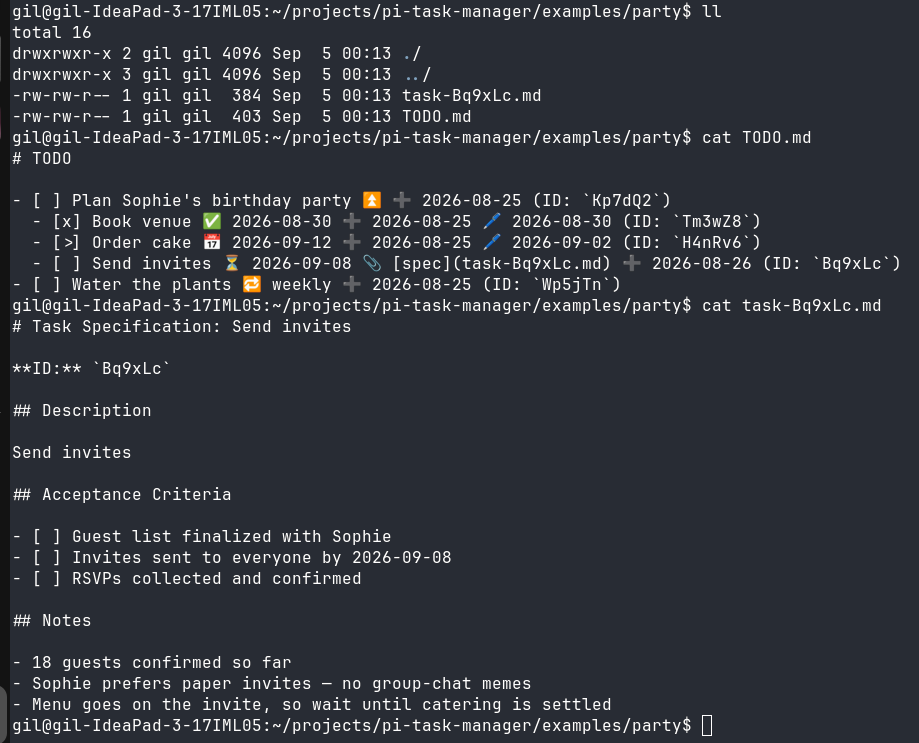

# pi-task-manager

A task tree your pi agent grows, in a `TODO.md` file you can still read.

Your pi agent plans and tracks work as a hierarchical tree of tasks, persisted
in plain `TODO.md` in your project directory. The file auto-opens at session
start, so the agent picks up where it left off — and since it's markdown, you
can grep it, read it, or hand-edit it yourself. No server, no database, no
subprocess: 7 `task_*` tools over pure TypeScript.

## In action

```text
you:  "keep track of Sophie's birthday party — the venue is booked,
      order the cake by the 12th, invites go out next week"
pi:   created the party task and three subtasks
```

what lands on disk (auto-saved, `examples/party/TODO.md`):

```markdown
- [ ] Plan Sophie's birthday party ⏫ ➕ 2026-08-25 (ID: `Kp7dQ2`)
  - [x] Book venue ✅ 2026-08-30 ➕ 2026-08-25 🖊️ 2026-08-30 (ID: `Tm3wZ8`)
  - [>] Order cake 📅 2026-09-12 ➕ 2026-08-25 🖊️ 2026-09-02 (ID: `H4nRv6`)
  - [ ] Send invites ⏳ 2026-09-08 📎 [spec](task-Bq9xLc.md) ➕ 2026-08-26 (ID: `Bq9xLc`)
- [ ] Water the plants 🔁 weekly ➕ 2026-08-25 (ID: `Wp5jTn`)
```

…same file in your terminal:



The `📎` task has a real note file beside it — `examples/party/task-Bq9xLc.md`,
also in the repo.

## Install

```bash
pi install npm:pi-task-manager
```

Any git source works too: `pi install git:github.com/gilgil/pi-task-manager`,
`pi install https://github.com/gilgil/pi-task-manager`, or
`pi install /local/path`. Pin a tag for stability:
`pi install git:github.com/gilgil/pi-task-manager@v0.2.0`;
`pi update --extensions` reconciles the clone to the pinned ref.

The extension registers the tools and the `task-manager` skill automatically.
If a `TODO.md` exists in the working directory, it is opened automatically at
session start (with a notification).

## Task file format

```markdown
# TODO

- [ ] Buy milk ➕ 2026-08-15 🖊️ 2026-08-15 (ID: `5Tvc0d`)
  - [ ] Organic 📅 2026-08-20 (ID: `VpLDzY`)
  - [x] Oat milk ✅ 2026-08-14 (ID: `Ab3x9Z`)
- [>] Write report ⏳ 2026-08-16 (ID: `Qw7m2K`)
```

- **Indentation** (2 spaces) defines the tree — each task's children are the
  indented lines beneath it.
- **Status** — exactly one character in the checkbox: `[ ]` open ·
  `[x]` done · `[>]` in-progress · `[!]` failed · `[-]` cancelled
- **Emoji annotations** between description and ID:
  `⏳` scheduled · `🛫` start · `📅` due · `✅` done · `❌` cancelled ·
  `➕` created · `🖊️` modified (omitted when it equals the created date) ·
  priorities `⏬` `🔽` `🔼` `⏫` `🔺` ·
  `🔁` recurrence · `⛔` dependencies · `📎 [spec](task-<id>.md)` note file
- **ID**: 6-char base62, stable, referenced by `parent_id`, `depends_on`, etc.
- `depth`, `position`, and `parent_id` are always derived from the tree —
  never stored.
- **Anything that is not a task line is left alone.** Prose, headers, plain
  bullets, and notes are kept verbatim through every save, so you can hand-edit
  the file freely. (Lines that *look* like tasks but cannot be parsed — no ID,
  indented deeper than 8 levels — are preserved as plain text too.)

## Tools

| Tool | Purpose |
|------|---------|
| `task_open(path)` | Open `<path>/TODO.md` (created if missing). Call once first. |
| `task_add(description, ...)` | Add a task. Returns the new ID. |
| `task_edit(task_id, ...)` | Change fields; only provided fields change. |
| `task_move(task_id, ...)` | Move a task **with its subtree**. No destination = delete task + subtree. |
| `task_get(task_id)` | Full details of one task. |
| `task_list(...)` | List tasks: `parent_id` gives its direct children (`include_subtasks` for the whole subtree); no `parent_id` lists everything. `status` / `priority` filter the result. |
| `task_close()` | Save and close. Mutations already auto-save. |

### Hierarchy parameters

- `parent_id` — add/move as **last child** of this task
- `before_id` / `after_id` — insert at the **same level**, before/after that
  sibling (must share the target's parent)
- `task_move` with no `under_id`/`before_id`/`after_id` deletes the task and
  its subtree

### Other fields

- `priority`: `lowest` `low` `normal` `medium` `high` `highest`
- dates (`scheduled`, `start`, `due`): `YYYY-MM-DD`
- `recurrence`: `daily` `weekly` `monthly` `yearly`, or
  `every N days/weeks/months/years` — optionally suffixed `on <Weekday>`
  (e.g. `weekly on Monday`). One line, no annotation emojis (it is written into
  the task line as free text). Completing a recurring task (`x`) inserts the
  next instance as the following sibling, carrying over its description,
  priority, recurrence and dependencies, with `due` advanced to the next
  occurrence (`scheduled` instead when the original had only a scheduled date).
- `on_completion`: `keep` (default — the completed task stays) ·
  `delete` (remove it once done; skipped with a warning if it has sub-tasks)
- `depends_on`: list of task IDs (circular dependencies rejected)
- `spec: true` — also create a `task-<id>.md` spec file
- setting status to `x` / `-` stamps `date_done` / `date_cancelled`

## Development

```bash
npm install
npm test
```

Layout: `index.ts` (tool registration) · `lib/`
(`task.ts` tree node, `parser.ts` line ⇄ tree, `task-manager.ts` mutations,
`recurrence.ts` next-instance rules, `render.ts` compact tool results,
`tools.ts` TypeBox schemas) · `skills/task-manager/SKILL.md` (LLM usage guide).
